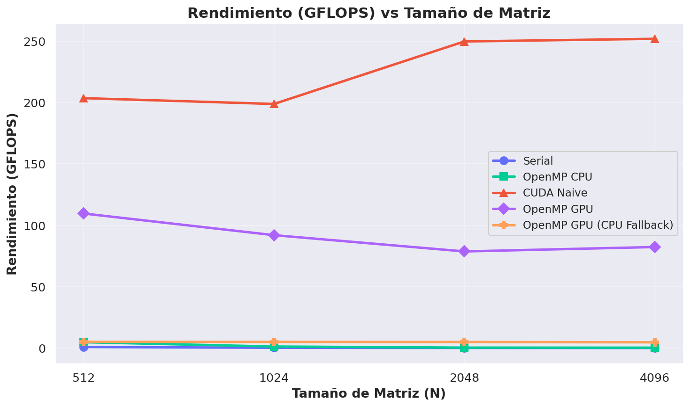
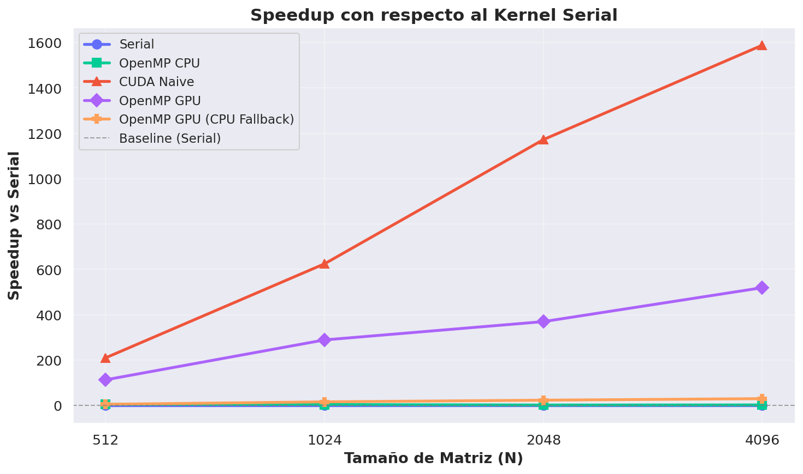
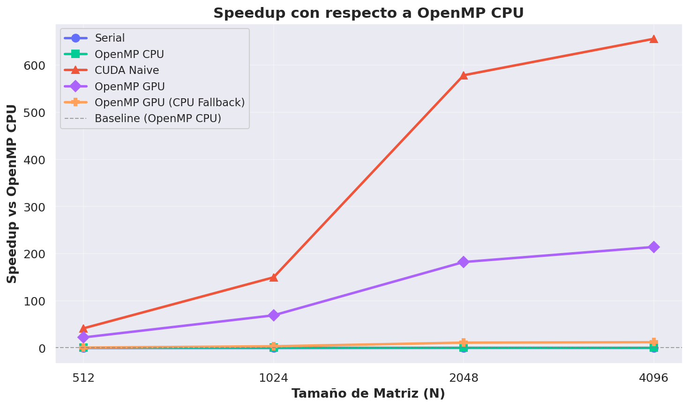
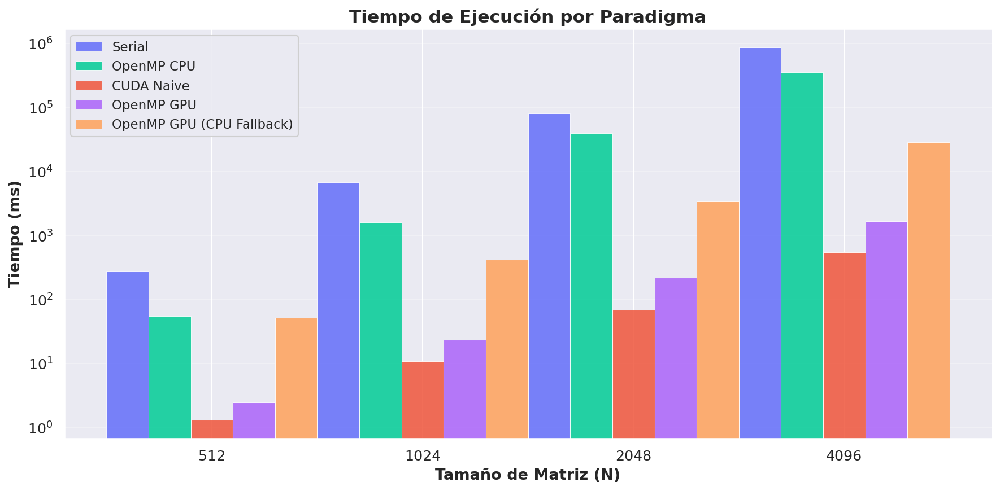

<!-- _class: lead -->
<!-- _paginate: false -->

# OpenMP GPU Offload

## Comparación de Paradigmas de Paralelismo para GEMM

**Grupo 3** — `target teams distribute parallel for`

*Taller de HPC — Multiplicación de Matrices*

---

# Agenda

1. Problema: Multiplicación de matrices (GEMM)
2. Paradigmas evaluados
3. OpenMP GPU Offload: conceptos clave
4. Mapeo de memoria: `map()`
5. Jerarquía de hilos y equivalencia con CUDA
6. Código implementado
7. Resultados experimentales y tablas
8. Análisis comparativo
9. Conclusiones

---

# El Problema: GEMM

**Multiplicación de matrices cuadradas:** $C = A \times B$

$$C[i][j] = \sum_{k=0}^{N-1} A[i][k] \cdot B[k][j]$$

| Propiedad | Valor |
|-----------|-------|
| Tipo de dato | `float` (fp32), row-major |
| Complejidad | $O(N^3)$ |
| FLOPs por ejecución | $2 \cdot N^3$ |
| Tamaños evaluados | $N \in \{512, 1024, 2048, 4096\}$ |

> Para $N = 4096$: $2 \times 4096^3 \approx 137.4$ GFLOP por ejecución

---

# Paradigmas Evaluados

| Paradigma | Compilador | Dispositivo |
|-----------|-----------|-------------|
| **Serial** | `g++ -O2` | CPU (1 hilo) |
| **OpenMP CPU** | `g++ -O2 -fopenmp` | CPU (multi-hilo) |
| **CUDA Naive** | `nvcc -O2` | GPU (sin shared mem) |
| **OpenMP GPU** | `nvc++ -mp=gpu` | GPU (offload) |
| **OpenMP GPU (CPU)** | `g++ -fopenmp` | CPU (fallback portabilidad) |

### Protocolo de medición estandarizado
- Inicialización determinista: $A[i][j] = (i+j)/N$, $B[i][j] = (i-j+N)/N$
- 1 calentamiento + 5 repeticiones → **mediana** en ms
- Verificación vs serial ($N \le 1024$, tolerancia $< 10^{-3}$)

---

# ¿Qué es OpenMP GPU Offload?

Extensión de OpenMP (v4.0+) para **ejecutar código en GPUs** con directivas.

| Aspecto | CUDA | OpenMP Target |
|---------|------|---------------|
| Portabilidad | Solo NVIDIA | Multi-vendor |
| Modelo | Kernel explícito | Directivas `#pragma` |
| Complejidad | Alta (~50 líneas extra) | Baja (~3 pragmas) |
| Código fuente | `.cu` separado | Mismo `.cpp` |
| Fallback CPU | No | Sí, automático |

> **Mismo código** compila para NVIDIA, AMD, Intel o CPU sin cambios.

---

# Mapeo de Memoria: `map()`

El GPU tiene **memoria propia**. Transferimos datos con `map()`:

```cpp
#pragma omp target data map(to: A[0:N*N], B[0:N*N]) map(from: C[0:N*N])
```

| Cláusula | Dirección | Cuándo se usa |
|----------|-----------|---------------|
| `map(to:)` | Host → Device | Datos de entrada (A, B) |
| `map(from:)` | Device → Host | Datos de salida (C) |
| `map(tofrom:)` | Bidireccional | Datos que se leen y modifican |
| `map(alloc:)` | — | Solo reservar en device |

> Separar `target data` del `target teams` evita transferencias redundantes por iteración.

---

# Jerarquía de Hilos OpenMP GPU

```
target                    ← Offload al dispositivo GPU
  └─ teams                ← Crear "ligas" de hilos (≈ bloques CUDA)
      └─ distribute       ← Repartir iteraciones entre teams
          └─ parallel for ← Paralelizar dentro de cada team
```

**Forma compacta (usada en nuestro código):**

```cpp
#pragma omp target teams distribute parallel for collapse(2)
```

| OpenMP GPU | CUDA | Descripción |
|------------|------|-------------|
| `target` | `<<<>>>` launch | Offload al GPU |
| `teams` | Grid de bloques | Grupos independientes |
| `distribute` | `blockIdx` | Reparto entre bloques |
| `parallel for` | `threadIdx` | Hilos dentro del bloque |
| `collapse(2)` | Grid 2D | Aplanar loops anidados |

---

# Código: OpenMP GPU Offload

```cpp
void matmul_omp_gpu(const float* A, const float* B, float* C, int N) {
    #pragma omp target data map(to: A[0:N*N], B[0:N*N]) map(from: C[0:N*N])
    {
        #pragma omp target teams distribute parallel for collapse(2)
        for (int i = 0; i < N; i++) {
            for (int j = 0; j < N; j++) {
                float acc = 0.0f;
                for (int k = 0; k < N; k++)
                    acc += A[i*N + k] * B[k*N + j];
                C[i*N + j] = acc;
            }
        }
    }
}
```

> **3 líneas de pragma** transforman código serial en código GPU.
> El mismo código compila con `nvc++` (GPU) o `g++` (CPU fallback).

---

# Código: CUDA Naive (referencia)

```cpp
__global__ void gemm_cuda_naive(const float* A, const float* B, float* C, int N) {
    int row = blockIdx.y * blockDim.y + threadIdx.y;
    int col = blockIdx.x * blockDim.x + threadIdx.x;
    if (row < N && col < N) {
        float sum = 0.0f;
        for (int k = 0; k < N; k++)
            sum += A[row * N + k] * B[k * N + col];
        C[row * N + col] = sum;
    }
}
// + cudaMalloc, cudaMemcpy, <<<grid,block>>>, cudaFree (~30 líneas extra)
```

> CUDA requiere gestión explícita de memoria y configuración de lanzamiento.
> OpenMP GPU abstrae todo esto con directivas.

---

# Resultados: GFLOPS vs N



---

# Resultados: Speedup vs Serial



---

# Resultados: Speedup vs OpenMP CPU



---

# Resultados: Tiempo de Ejecución



---

# Tabla de Resultados: Tiempo (ms)

| N | Serial | OMP CPU | CUDA Naive | OMP GPU | OMP GPU (CPU) |
|---:|-------:|--------:|-----------:|--------:|--------------:|
| 512 | 277.30 | 55.20 | 1.32 | 2.45 | 51.91 |
| 1024 | 6,748.36 | 1,619.69 | 10.80 | 23.34 | 420.26 |
| 2048 | 80,663.80 | 39,785.57 | 68.81 | 218.15 | 3,445.55 |
| 4096 | 866,942.64 | 357,704.88 | 545.75 | 1,669.18 | 28,774.18 |

> Tiempos en milisegundos. Se reporta la **mediana** de 5 repeticiones.

---

# Tabla de Resultados: GFLOPS

| N | Serial | OMP CPU | CUDA Naive | OMP GPU | OMP GPU (CPU) |
|---:|-------:|--------:|-----------:|--------:|--------------:|
| 512 | 0.97 | 4.86 | 203.53 | 109.62 | 5.17 |
| 1024 | 0.32 | 1.33 | 198.80 | 92.00 | 5.11 |
| 2048 | 0.21 | 0.43 | 249.69 | 78.75 | 4.99 |
| 4096 | 0.16 | 0.38 | 251.84 | 82.34 | 4.78 |

> **CUDA Naive** logra el mayor rendimiento (~252 GFLOPS en N=4096).
> **OpenMP GPU** alcanza ~82-110 GFLOPS. **OMP GPU (CPU)** mantiene ~5 GFLOPS constantes.

---

# Análisis: OpenMP GPU vs CUDA Naive

### Ventajas OpenMP GPU
- **Portabilidad** multi-vendor (NVIDIA, AMD, Intel, CPU)
- **Simplicidad**: 3 pragmas vs ~50 líneas CUDA
- **Mantenibilidad**: un solo `.cpp` para GPU y CPU
- **Fallback CPU** automático sin cambiar código

### Desventajas OpenMP GPU
- **Rendimiento**: ~40-55% del CUDA naive
- **Sin shared memory** ni control fino de bloques
- **Compiladores**: requiere `nvc++` o `clang` con offload
- **Debugging**: ecosistema menos maduro

> OMP GPU (CPU Fallback) mantuvo ~5 GFLOPS constantes vs OMP CPU que cayó a 0.38 en N=4096.

---

# ¿Cuándo usar cada paradigma?

| Escenario | Recomendación |
|-----------|---------------|
| Prototipado rápido | OpenMP GPU |
| Máximo rendimiento NVIDIA | CUDA (optimizado) |
| Código portable multi-GPU | OpenMP GPU |
| Migrar código OpenMP CPU | Agregar `target` |
| Código académico/docencia | OpenMP GPU |
| Producción con shared memory | CUDA / HIP |

> **OpenMP GPU** es ideal como primer paso hacia GPU computing.
> Para exprimir el hardware, CUDA sigue siendo el rey.

---

# Conclusiones

1. **OpenMP GPU Offload** permite ejecutar en GPUs con **mínimas modificaciones** al código fuente (3 pragmas)

2. La jerarquía `target → teams → distribute → parallel for` mapea directamente a la arquitectura GPU

3. Rendimiento de **~82-110 GFLOPS** (vs ~252 CUDA naive): ~40-55% del rendimiento nativo

4. **Portabilidad demostrada**: el mismo código compiló y ejecutó en GPU (nvc++) y CPU (g++) sin cambios

5. Para $N \ge 2048$, el GPU supera al CPU multi-hilo por **180-500×**

6. **OMP GPU (CPU)** mantuvo rendimiento estable (~5 GFLOPS) mientras OMP CPU degradó a 0.38

### Referencias
- OpenMP 5.2 Specification — openmp.org
- *Programming Your GPU with OpenMP* — Deakin & Mattson
- NVIDIA HPC SDK Docs — developer.nvidia.com

---

<!-- _class: lead -->
<!-- _paginate: false -->

# ¿Preguntas?

## ¡Gracias!

**Grupo 3 — OpenMP GPU Offload**

*Taller de Comparación de Paradigmas de Paralelismo*
